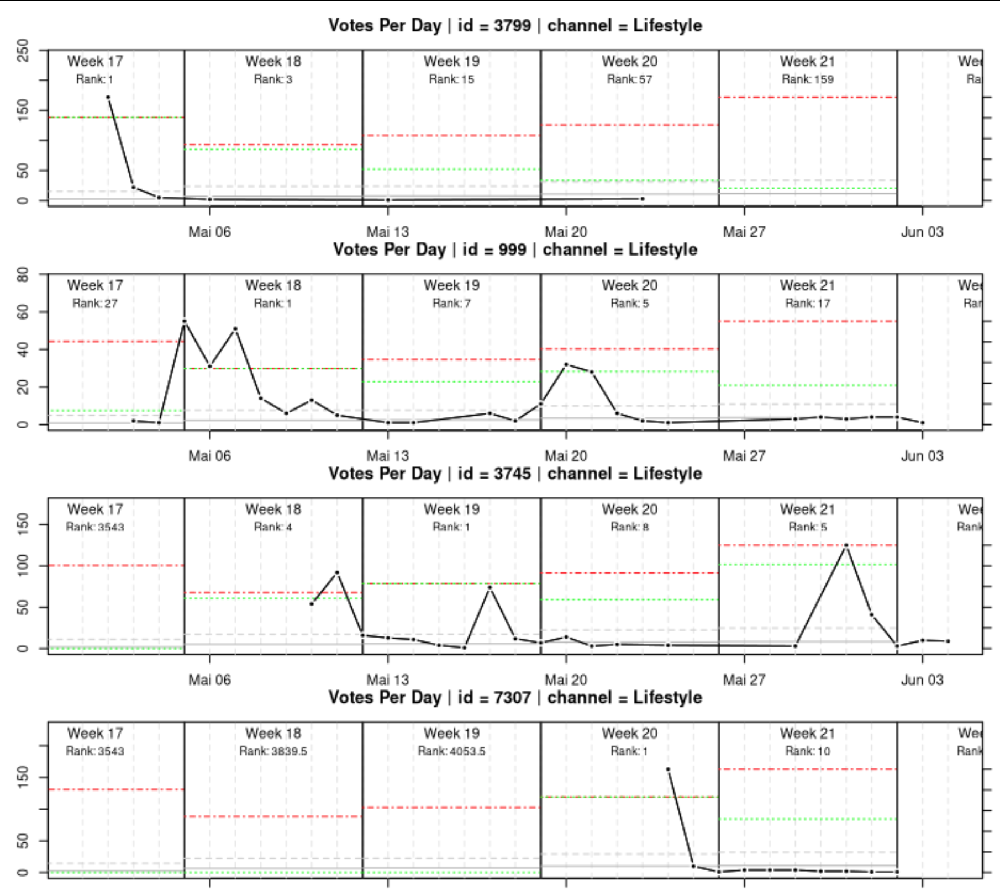

# Dynamic Centrality

Exploring Dynamic Communicability Matrix Models - Project Nov, 2020

Check out the [presentation](https://docs.google.com/presentation/d/1aR9St2Se3CMzfSgwUSrhMeS1zwpEkEdOkKWBBX0Sv9k/edit?usp=sharing)

Project creates and RProject. Check *codes/tobias_analysis.R* for a working example

## Description

Capture the relative importance of users in a dynamic time framework - discrete and continuous - using the algorithm introduced in *Grindrod & Higham (2012): A matrix iteration for dynamic network summaries*.
The proposed algorithm can be regarded as a generalisation of Dynamic Communicability Matrix Centrality Models and Alpha Centralities.

